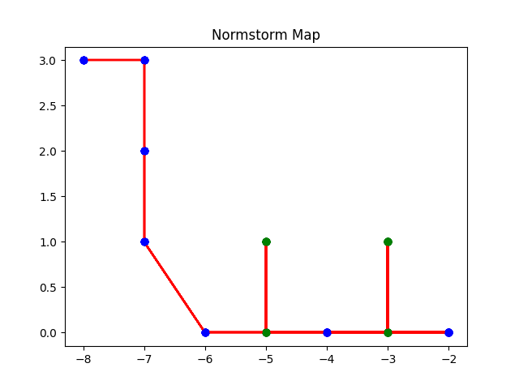

The Normstorm is a 2 wheeled autonomous rover designed to explore maps of a certain format, created by Edward Speer and Garrett Knuf for Caltech ME/CS/EE 129 in Spring of 2023. The bot consists of a chasis with two rear drive motors which provide power to the two rear wheels, and a front roller ball. The bot sees the world through 3 front mounted IR sensors which look at the floor, and 3 ultrasound detectors which face forwards, left, and right from the front of the bot. Robot control is done by a Raspberry pi connected to the motor controller and both sets of sensor hardware through GPIO.

### Check out the latest map the NormStorm explored!

### System Specs:
- Debian GNU/Linux 11
- Python 3.9.2 including:
    - Tkinter with PIL, ImageTk
    - Pigpio
    - Maplotlib

### Run Options:
All program execution is done via the Makefile which offers the following targets:
- run (default): Start the robot gui, take in user input, and execute the user specified commands
- motor_test: Test the motor hardware by driving a pattern of prescribed actions
- sensor_test: Test the IR sensor hardware by viewing the reading values in the terminal
- ultrasound_test: Test the ultrasound hardware by viewing the reading values in the terminal

### Robot Environment:
The environment the robot is meant to operate it is subject to the following contstraints:
- The robot explores and maps out a grid of black tape "streets" adhered to a white floor in which the distance between intersections is a unit length (55 cm) along any street
- Every street ends in an "intersection" - if there is a dead end, this is a short piece of perpendicular tape marking the end of the street
- Any street may be blocked, permanently or temporarily, by some object
- Streets may intersect at any angle which is a multiple of 45 degrees
    - From a particular intersection, streets do not exist on adjacent headings (If there is a street at 45 degrees, there is not one at 90 degrees for example)

The robot expresses its location in this environment as a location and a heading:
- Location: (x, y) - relative coordinates to a user specifed start coordinate
- Heading: 0-7 - Number of 45 degree increments turned left of the user specified start heading (With right turn increments being negative left turn inrements)

### Robot Control:
The robot accepts the following commands into the GUI:
- Explore: Autonomously explore the map until all intersections are blocked off or fully mapped
- Goal x,y: Drive to the point (x, y). If a path is known follow that path. If not, perform directed exploration - Try to drive to the point as best as possible with known information, and then explore the most likely paths to reach the point until the point is found or the point cannot be reached
- Quit: Completely quit the GUI and all robot activity
- Stepping: Start up stepping mode which only allows the robot to move one intersection at a time
- Step: Take one step in stepping mode
- Pause: Upon reaching the next intersection, pause the robot
- Save: Saves the current map data structure to a pickle file upon reaching an intersection
- Clear: Removes all blockages from the current map
- Reset: (Must be called while in explore mode) - Allows the user to manually reset the robot heading and location from within explore mode, and select whether or not te clear the map
